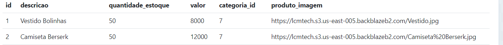
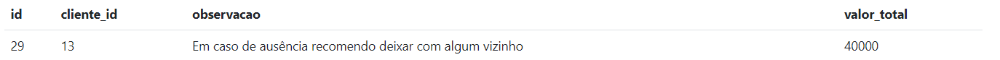
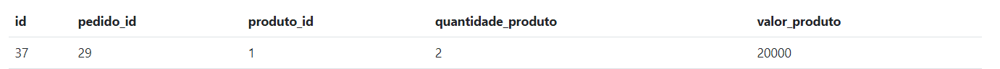

# API-PDV (Frente de Caixa) 

Application Programming Interface (Interface de Programação de Aplicação) - API Para ponto de Venda - PDV.


# :clipboard: Descrição do Projeto

Consiste em uma API Rest que controla operações de ponto de Venda, o ponto de venda refere-se ao local onde uma transação comercial é concluída, como uma loja física ou online . Essa API oferece funcionalidades que possibilitam a automação e otimização de processos relacionados às vendas com segurança e proteção dos dados através da criptografia e autenticação do usuário via token.
Utilizando também operações de CRUD - Create, Read, Update, Delete.
Envio de Emails, e Upload de Arquivos.
Oferece conexão com Banco de Dados Remoto ou local Ex: ElephantSQL ou PostgresSQL.

# Funcionalidades do Projeto

✅ Cadastrar Usuário<br>

- Recebe dados do usuário (Ex: nome, email, senha)
- Faz as Validações Padrões de requisição (Ex: Campos obrigátorios)
- Criptografa a senha do usuário.
- Insere os dados no Banco de Dados

✅ Atualizar Usuário <br>

- Recebe dados do usuário (Ex: nome, email, senha)
- Faz as Validações Padrões de requisição (Ex: Campos obrigátorios)
- Criptografa a senha do usuário.
- Atualiza os Dados do usuário no Banco de Dados.

✅ Detalhar Usuário <br>

- Obtem os dados do usuário Logado.

✅ Logar <br>

- Implementa a autenticação por meio de JWT, onde um token é gerado após validar as credenciais do usuário.

✅ Cadastrar Cliente<br>

- Recebe dados do Cliente (Ex: nome, email, cpf)
- Faz as Validações Padrões de requisição (Ex: Campos obrigátorios)
- Insere os dados no Banco de Dados

✅ Atualizar Cliente <br>

- Recebe dados do Cliente (Ex: nome, email, cpf)
- Faz as Validações Padrões de requisição (Ex: Campos obrigátorios)
- Atualiza os Dados do cliente no Banco de Dados.

✅ Detalhar Cliente<br>

- Obtem os dados do cliente.

✅ Listar Clientes <br>

- Lista todos os clientes cadastrados.

✅ Cadastrar Produto <br>

- Recebe dados do Produto via multipartForm Data (Ex: imagem do produto , descricao, quantidade, valor);
- Faz as Validações Padrões de requisição (Ex: Campos obrigátorios)
- Faz Conexão com Serviço Amazon S3 (Simple Storage Service): Um serviço de armazenamento de objetos da Amazon Web Services (AWS). Para fazer Upload das Imagens.
- Conexão com serviços de armazenamento em nuvem Backblaze B2 Cloud Storage.
- Insere os dados no Banco de Dados e a Imagem Bucket da BackBlaze.

##### Ex : Tabela Produtos



✅ Atualizar Produto <br>

- Recebe dados do Produto via multipartForm Data (Ex: imagem do produto , descricao, quantidade, valor);
- Faz as Validações Padrões de requisição (Ex: Campos obrigátorios)
- Faz Conexão com Serviço Amazon S3 (Simple Storage Service) Para fazer Upload das Imagens e deletar a Imagem anterior.
- Conexão com serviços de armazenamento em nuvem Backblaze B2 Cloud Storage.
- Atualiza os dados no Banco de Dados e a Imagem no Bucket da BackBlaze.

✅ Excluir Produto<br>

- Obtem o id do produto a ser excluido via req.params .
- Verifica a existencia do Produto.
- Exclui o produto somente se não estiver vinculado a um pedido.
- Faz Conexão com Serviço Amazon S3 (Simple Storage Service) Para fazer a exclusão da Imagem do produto.
- Exclui a Imagem do Produto da BackBlaze e os dados do produto no Banco de Dados.

✅ Obter Produto<br>

- Detalhar os dados do produto específico

✅ Cadastrar Pedido <br>

- Recebe dados do Pedido (Ex: Identificador do cliente, produtos , obervação)
- Restrições para produto (Ex: Para cadastrar pedido informar pelo menos um produto)
- Calcula o valor total do pedido.
- Insere os dados no banco de dados.

##### Ex : Tabela Pedidos



##### Ex : Tabela Pedidos_Produtos



✅ Listar Pedidos<br>

- Lista todos os pedidos cadastrados
- Caso informado parametro de filtro, Lista por pedidos específicos.

✅ Listar Categorias<br>

- Lista todas as categorias cadastradas banco de dados.

# Demonstração


# :hammer_and_pick: Tecnologias Utilizadas

<div style="display:inline">


</div>

### :hammer_and_pick: Dependências Utilizadas no Projeto

- bcrypt :closed_lock_with_key: (Responsável pela Criptografia das senhas)
- express (processo de criação de servidores web)
- pg (conexao ao banco de dados PostgreSQL)
- nodemon dependência de desenvolvimento (automaticamente reinicia o servidor quando mudanças são detectadas)
- dotenv ( gerenciamento variáveis de ambiente)
- jsonwebtoken :key: (criação de tokens )
- Knex (query builder)
- joi (schemas)
- nodemailer (envio de e-mails)
- aws-sdk (armazenamento de objetos em nuvem)
- cors (mecanismo de segurança )

# 🚀 Inicialização

- npm install : Esse comando vai ler o arquivo package.json no diretório do seu projeto, identificar todas as dependências listadas nele, e instalar todas no diretório node_modules local.

# Variáveis de Ambiente

- As variavéis de Ambiente estão no arquivo <p style="color:green ;display:inline">.env.example</p> neste Repositório

# Execução do Projeto

O projeto pode ser executado utilizando o <strong style ="color:purple">Insomia</strong>
Path : http://localhost:porta
<br> Através das Rotas Abaixo:

```http
  POST /usuario
```

| Parâmetro | Tipo     | Descrição                                |
| :-------- | :------- | :--------------------------------------- |
| `nome`    | `string` | **Obrigatório**.                         |
| `email`   | `string` | **Obrigatório** : Email válido.          |
| `senha`   | `string` | **Obrigatório**.: No mínimo 5 caracteres |

```http
  POST/login
```

| Parâmetro | Tipo     | Descrição                                |
| :-------- | :------- | :--------------------------------------- |
| `email`   | `string` | **Obrigatório**. Email válido.           |
| `senha`   | `string` | **Obrigatório** : No mínimo 5 caracteres |

```http
  PUT/usuario
```

| Parâmetro | Tipo     | Descrição                                |
| :-------- | :------- | :--------------------------------------- |
| `nome`    | `string` | **Obrigatório**.                         |
| `email`   | `string` | **Obrigatório** : Email válido.          |
| `senha`   | `string` | **Obrigatório**.: No mínimo 5 caracteres |
| `Token`   | `string` | **Obrigatório**.: Usuário autenticado    |

```http
  GET/usuario
```

| Parâmetro | Tipo     | Descrição                            |
| :-------- | :------- | :----------------------------------- |
| `Token`   | `string` | **Obrigatório**. Usuário Autenticado |

```http
  POST/cliente
```

| Parâmetro | Tipo     | Descrição                            |
| :-------- | :------- | :----------------------------------- |
| `nome`    | `string` | **Obrigatório**.                     |
| `email`   | `string` | **Obrigatório** :                    |
| `cpf`     | `string` | **Obrigatório**.:                    |
| `cep`     | `string` |                                      |
| `rua`     | `string` |                                      |
| `bairro`  | `string` |                                      |
| `cidade`  | `string` |                                      |
| `estado`  | `string` |                                      |
| `Token`   | `string` | **Obrigatório**. Usuário Autenticado |

```http
  PUT/cliente/${id}
```

| Parâmetro | Tipo     | Descrição                            |
| :-------- | :------- | :----------------------------------- |
| `nome`    | `string` | **Obrigatório**.                     |
| `email`   | `string` | **Obrigatório** :                    |
| `cpf`     | `string` | **Obrigatório**.:                    |
| `cep`     | `string` |                                      |
| `rua`     | `string` |                                      |
| `bairro`  | `string` |                                      |
| `cidade`  | `string` |                                      |
| `estado`  | `string` |                                      |
| `Token`   | `string` | **Obrigatório**. Usuário Autenticado |

```http
  GET/cliente/${id}
```

| Parâmetro | Tipo      | Descrição                                      |
| :-------- | :-------- | :--------------------------------------------- |
| `id`      | `Integer` | **Obrigatório**. O ID do cliente que você quer |
| `Token`   | `string`  | **Obrigatório**. Usuário Autenticado           |

```http
 POST/produto
```

obs: multipartForm data

| Parâmetro            | Tipo      | Descrição                            |
| :------------------- | :-------- | :----------------------------------- |
| `produto_imagem`     | `File`    |                                      |
| `quantidade_estoque` | `Integer` | **Obrigatório**.                     |
| `descricao`          | `string`  | **Obrigatório**.                     |
| `valor`              | `Integer` | **Obrigatório**. Número positivo     |
| `categoria_id`       | `Integer` | **Obrigatório**. id válido           |
| `Token`              | `string`  | **Obrigatório**. Usuário Autenticado |

```http
 PUT/produto${id}
```

obs: multipartForm data

| Parâmetro            | Tipo      | Descrição                            |
| :------------------- | :-------- | :----------------------------------- |
| `id`                 | `Integer` | **Obrigatório**. O ID do produto     |
| `produto_imagem`     | `File`    |                                      |
| `quantidade_estoque` | `Integer` | **Obrigatório**.                     |
| `descricao`          | `string`  | **Obrigatório**.                     |
| `valor`              | `Integer` | **Obrigatório**. Número positivo     |
| `categoria_id`       | `Integer` | **Obrigatório**. id válido           |
| `Token`              | `string`  | **Obrigatório**. Usuário Autenticado |

```http
GET/produto${id}
```

| Parâmetro | Tipo      | Descrição                            |
| :-------- | :-------- | :----------------------------------- |
| `id`      | `Integer` | **Obrigatório**. O ID do produto     |
| `Token`   | `string`  | **Obrigatório**. Usuário Autenticado |

```http
 DELETE/produto${id}
```

| Parâmetro | Tipo      | Descrição                            |
| :-------- | :-------- | :----------------------------------- |
| `id`      | `Integer` | **Obrigatório**. O ID do produto     |
| `Token`   | `string`  | **Obrigatório**. Usuário Autenticado |

```http
 POST/pedido
```

| Parâmetro            | Tipo      | Descrição                            |
| :------------------- | :-------- | :----------------------------------- |
| `cliente_id`         | `Integer` | **Obrigatório**. O ID do cliente     |
| `observacao`         | `string`  | **Obrigatório**.                     |
| `pedido_produtos`    | `Array`   | **Obrigatório**.                     |
| `produto_id`         | `Integer` | **Obrigatório**. id válido           |
| `quantidade_produto` | `Integer` | **Obrigatório**. Número positivo     |
| `Token`              | `string`  | **Obrigatório**. Usuário Autenticado |

```http
 GET/pedido
```

| Parâmetro | Tipo     | Descrição                            |
| :-------- | :------- | :----------------------------------- |
| `Token`   | `string` | **Obrigatório**. Usuário Autenticado |

```http
 GET/clientes
```

| Parâmetro | Tipo     | Descrição                            |
| :-------- | :------- | :----------------------------------- |
| `Token`   | `string` | **Obrigatório**. Usuário Autenticado |

```http
 GET/categoria
```

```http
 GET/produto
```

| Parâmetro | Tipo     | Descrição                            |
| :-------- | :------- | :----------------------------------- |
| `Token`   | `string` | **Obrigatório**. Usuário Autenticado |

# 🤝Contribuições

Siga os passos abaixo para contribuir:

1. Faça o fork do projeto (https://github.com/CarolinaSanches24/API-PDV)

2. Clone o seu fork para sua maquína (git clone https://github.com/user_name/REPO_NAME.git)

3. Crie uma branch para realizar sua modificação (git checkout -b feature/name_new_feature)

4. Adicione suas modificações e faça o commit (git commit -m "Descreva sua modificação")

5. Push (git push origin feature/name_new_feature)

6. Crie um novo Pull Request

Pronto, agora só aguardar a análise

# :black_nib: Autoras

<div style="display:flex">
<div style="display:flex">
<div style="width:500px">
<p style="margin-right:50px">CAROLINA SANCHES</p>
<p style="font-size=16px; text-align:justify"><b>Desenvolvedora de Software</b> <br>
Graduada em Licenciatura em Informática<br>
Pós Graduanda de Engenharia de Software<br>
Técnica em Informática</p>
</div>


<br>
</div>
<div style="display:flex">
<div style="width:400px">
<p style="margin-left:50px">TAIS COSTA</p>
<p style="font-size=18px; text-align:justify; margin-left:50px"><b>Desenvolvedora de Software</b> <br>
</p>
</div>

</div>
